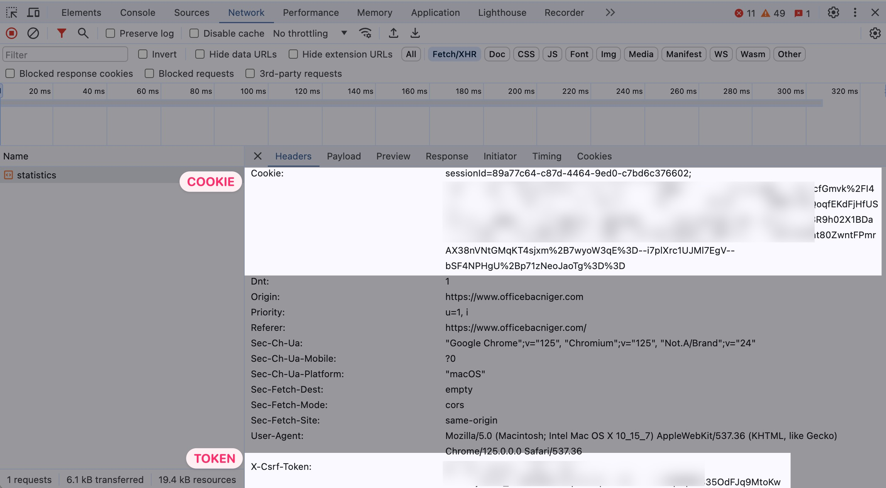

# Extracteur et Analyseur des Résultats du Baccalauréat 2024 du Niger

## Motivation

Le site officiel du Baccalauréat 2024 du Niger (https://www.officebacniger.com/) ne présente les résultats que jury par jury. Cet outil extrait et agrège les données de tous les jurys, offrant une vue d'ensemble complète des résultats du Baccalauréat 2024.

## Fonctionnalités

- Extraction des données de résultats de tous les jurys
- Agrégation des statistiques de l'ensemble des jurys
- Visualisations des résultats globaux
- Sauvegarde des données extraites pour une analyse ultérieure

## Méthode d'Extraction et d'Analyse

L'extracteur et l'analyseur fonctionnent selon le processus suivant :

1. **Extraction des Données**
   - L'outil simule des requêtes HTTP vers le site officiel pour chaque jury.
   - Il utilise les cookies et tokens d'authentification pour accéder aux pages de statistiques.
   - Les requêtes sont espacées aléatoirement pour éviter de surcharger le serveur.

2. **Parsing des Données**
   - Le HTML de chaque page de jury est analysé avec BeautifulSoup.
   - Les informations clés (nom du jury, données du tableau, données graphiques) sont extraites.

3. **Traitement des Statistiques**
   - Les données de chaque jury sont agrégées.
   - Des totaux sont calculés pour différentes catégories (admis, second groupe, refusés, absents).
   - Des statistiques détaillées sont compilées, incluant la répartition par genre.

4. **Stockage des Données**
   - Les données brutes et traitées sont sauvegardées en format JSON.
   - `stats_final.json` contient les données détaillées de tous les jurys.
   - `tallies.json` contient les statistiques agrégées par jury.

5. **Visualisation**
   - Un graphique circulaire est généré pour représenter la répartition globale des résultats.

6. **Analyse**
   - Les données agrégées permettent une analyse approfondie des résultats :
     - Taux de réussite global et par jury
     - Répartition des résultats par genre
     - Comparaison entre différents jurys ou régions

## Prérequis

- Python 3.6 ou supérieur
- Bibliothèques Python : requests, beautifulsoup4, matplotlib, tqdm, python-dotenv

## Configuration

1. Clonez cette repo sur votre machine locale.
2. Installez les dépendances :
   ```
   pip install -r requirements.txt
   ```
3. Créez un fichier `.env` à la racine du projet avec les informations suivantes :
   ```
   COOKIE=votre_cookie_ici
   TOKEN=votre_token_ici
   ```

Pour obtenir le cookie et le token ([tuto video](assets/tutorial.mp4)):
1. Naviguez sur le site https://www.officebacniger.com/
2. Ouvrez les outils de développement de Chrome (F12)
3. Allez dans l'onglet "Network"
4. Effectuez une recherche de resultats (selectionnez un jury et le groupe, cliquez sur "voir les statistiques")
5. Trouvez une requête vers le site et copiez le cookie et le token depuis les en-têtes de la requête

<center></center>

## Utilisation

Exécutez le script :
```
python extract.py
```

Le script va :
1. Extraire les données de tous les jurys
2. Traiter et agréger les statistiques
3. Sauvegarder les résultats dans `stats_final.json` et `tallies.json`
4. Afficher un graphique circulaire des résultats globaux

## Structure du Code

- `BacStatsFetcher` : Gère les requêtes HTTP vers le site officiel
- `DataExtractor` : Parse le HTML et extrait les données pertinentes
- `StatisticsProcessor` : Traite et agrège les statistiques
- `DataVisualizer` : Crée les visualisations des données

## Note

Cet outil est conçu à des fins éducatives et analytiques. Veuillez respecter les conditions d'utilisation du site officiel et éviter les requêtes excessives sur une courte période.

## Contribution

Les contributions pour améliorer l'outil ou étendre ses fonctionnalités sont les bienvenues. Veuillez soumettre une demande de pull ou ouvrir une issue pour discuter des modifications proposées.
